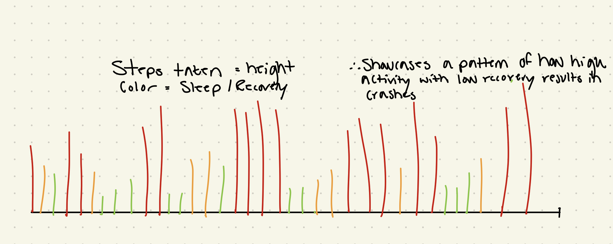
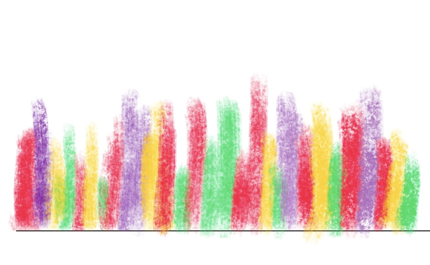

# Part 1: Set Up 

```{r}
#| label: set-up
#| message: false

# Reading in necessary packages 
library(tidyverse)
library(here)
library(janitor)
library(readxl)

# Storing kelp data as specified object 
kelp <- read_csv(
  here("data", "temp-kelp.csv"))

# Storing personal data as specificed object 
step_count <- read_csv(
  here("data", "MyData_HW3_Format.csv"))
```

# Part 2: Problems 

## Problem 1 - Giant Kelp Fronds

### a. An Appropriate Test

To evaluate the strength of the relationship between temperature ($C^o$) and giant kelp frond elongation rate ($cm day^-1$), a Pearson correlation test and a Spearman rank correlation test would both be suited to use. The Pearson correlation test will evaluate whether there is a linear relationship between the two continuous variables while also assuming a normal distribution and linear relationship and the Spearman-rank correlation test will evaluate if a relationship exists between the two variables without requiring a normal distribution. As both ocean temperature and elongation rate are continuous and quantitative variables, both tests could be used depending on whether the data is normally distributed and linear. 

### b. Create a Visualization 

```{r}
#| label: data-visualization

# Creating a ggplot base layer using kelp dataset 
  ggplot(data = kelp, 
         mapping = aes(x = temp_c, # x-axis is temp
                       y = kelp_elong)) + # y-axis is kelp elongationo 
  
  # First layer is a scatter plot to visualize individual observations 
  geom_point(size = 2, # adjusting size 
             alpha = 0.7, # adjusting opacity
             color = "#2E8B57", # adjusting color to green
             shape = 21) + # adjusting shape type
  # Second layer is a line of best fit using a linear regression
  geom_smooth(method = "lm", # running a linear regression
              color = "black", # making the line black 
              linewidth = 1 # changing linewidth
             ) + 
  # Using custom theme 
  theme_minimal() + 
  # Relabeling x & y axes
  labs(x = expression("Ocean Temperature (C"^o~")"), # expression is used to properly display celsius
       y = expression("Kelp Elongation Rate (cm day"^-1~")"), # expression used to properly display unit
       title = "The Effect of Ocean Water Temperature On
       Kelp Elongation Rate") # custom title
```

### c. Check Your Assumptions and Run Your Test 

```{r}
#| label: assumptions-test

# Creating a ggplot base layer using kelp dataset 
  ggplot(data = kelp, 
         mapping = aes(x = temp_c, # x-axis is temp 
                       y = kelp_elong)) + # y-axis is kelp elongation 
  
  # First layer is a scatter plot to visualize individual observations 
  geom_point(size = 2, # choosinig size of point
             alpha = 0.7, # adjusting opacity 
             color = "#2E8B57", # adjusting color 
             shape = 21) + # choosing specific shape type
  # Second layer is a line of best fit using a linear regression
  geom_smooth(method = "lm", # running a linear regression 
              color = "black", # choosing line color 
              linewidth = 1 # selecting linewidth 
             ) + 
  # Using custom theme 
  theme_minimal() + 
  # Relabeling x & y axes
  labs(x = expression("Ocean Temperature (C"^o~")"), # using expression to properly display celsius 
       y = expression("Kelp Elongation Rate (cm day"^-1~")"), # using expression to properly show unit 
       title = "The Effect of Ocean Water Temperature On  
       Kelp Elongation Rate") # creating custom title 
```

```{r}
#| label: checking-normality-elongation

# ggplot as base layer 
  ggplot(data = kelp, 
         mapping = aes(sample = kelp_elong)) + # specifying use of kelp elongation
  # first layer is QQ plot
  geom_qq() + 
  # second layer is QQ line 
  geom_qq_line(color = "red") + # making line red 
  # updating theme 
  theme_minimal() + 
  # updating title 
  labs(title = expression("QQ Plot for Kelp Elongation Rate (cm day"^-1~")"))
  
```

```{r}
#| label: checking-normality-temperature

# ggplot as the base layer 
   ggplot(data = kelp, 
    mapping = aes(sample = temp_c)) + # specifying use of temperature 
  # first layer is the qq plot 
  geom_qq() + 
  # second layer is the qq plot line 
  geom_qq_line(color = "red") + # making line red 
  # updating theme 
  theme_minimal() + 
  # updating title 
  labs(title = expression("QQ Plot for Ocean Water Temperature (C"^o~")")) #using expression to properly display celsius
```

**Write-Up:**

To evaluate whether a Pearson correlation test or a Spearman-rank correlation test should be used, I assessed the linearity of the two data in addition to each variable's distribution. Using a scatterplot with a fitted linear regression, it was determined that the data *appears* to have somewhat of a negatively linear relationship where as ocean temperature increases, kelp elongation rate decreases. Using qq plots, it was determined that both Ocean Temperature and Kelp Elongation Rate are normally distributed as data points fall along a liner line of best fit. 

```{r}
#| label: Pearson-correlation
#| message: True

# Running a Pearson correlation test 
cor.test(x = kelp$temp_c, # specifying which variable to use for x
         y = kelp$kelp_elong, # specifying which variable to use for y
         method = "pearson") # dictating a pearson test 
```

### d. Results Communication 

To evaluate the strength of the relationship between ocean temperature and giant kelp frond elongation rate, I used a Pearson correlation test as both variables were continuous and quantitative, followed a relatively negatively linear relationship, and had a normal distribution. In running the test, a strong negative relationship was found between ocean temperature and giant kelp frond elongation rate where kelp elongation rate decreases as ocean temperature increases (Pearson's product-moment correlation, t(30) = -5.19, p < 0.01, $\alpha$ = 0.05, CI [-0.836, -0.446]).

### e. Test Implications 

The results of this suggest that increasing ocean temperatures are associated with significantly lower giant kelp front elongation rates. As giant kelp forests provide habitat, food, and ecosystem stability for marine organisms, reduce growth rates could have wide-spread ecological consequences as ocean temperatures continue to rise due to climate change. 
### f. Double Check Your Own Work 

```{r}
#| label: Spearman-rank-correlation-test

# Running a spearman-rank correlation test 
cor.test(x = kelp$temp_c, # dictating which variable for x
         y = kelp$kelp_elong, # dictating which variable for y 
         method = "spearman") # dictating a spearman test 
```

**Write-Up:**

Both the Pearson correlation test (p < 0.01) and the Spearman-rank correlation test (p < 0.01) both gave results that rejected the null hypothesis of no relationship existing between ocean temperature and giant kelp frond elongation rates. For both tests, the p-values were less than $\alpha$ = 0.05. Additionally, both tests indicated a strong negative relationship between the two variables with the Pearson test identifying a strong negative relationship between ocean temperature and giant kelp frond elongation rate (Pearson's product-moment correlation, t(30) = -5.19, p < 0.01, $\alpha$ = 0.05, CI[-0.836, -0.446]) and the Spearman rank correlation test identifying a strong negative monotonic relationship (Spearman rank correlation test: $\rho$ = -0.689, S = 9216, p < 0.01). These results indicate that as ocean temperature increases, kelp elongation rate consistently decreases. 

## Problem 2 - Personal Data 

### a. Updating Your Visualizations
```{r}
# cleaning my data before creating ggplot 
my_data_clean <- step_count |> 
  # cleaning names 
  clean_names() |> 
  # removing any NA values 
  filter(!is.na(day_of_the_week))

# creating summary data to find the mean steps per each day of the week 
my_data_summary <- my_data_clean |> 
  # grouping the days of the week 
  group_by(day_of_the_week) |> 
  # calculating the mean number of steps for each day of the week
  summarise(mean_steps = mean(total_steps_taken_for_the_day)) |> 
  # ungrouping the data for good measure
  ungroup()

# ggplot as base layer 
ggplot(data = my_data_summary,
       # designating x and y axis to specified columns within the dataset 
       mapping = aes(x = fct_relevel(day_of_the_week, 
                       "Sun", 
                       "Mon", 
                       "Tue", 
                       "Wed", 
                       "Thurs", 
                       "Fri", 
                       "Sat"), y = mean_steps)) + 
  # Adding first layer 
  geom_col(fill = "steelblue4",
           color = "gray20",
           width = 0.5) +
  labs(x = "Day of the Week",
       y = "Total Daily Steps Taken",
       title = "Average Daily Step Count by Day of the Week",
       subtitle = "Most Reccent Observation: May 27, 2026") +
  theme_classic() + 
  # Customizing plot text and appearance 
  theme(plot.title = element_text(face = "bold", # bolding the title
                                  color = "gray10"), #making the title gray
        plot.subtitle = element_text(color = "gray35"), # choosing color
        axis.title = element_text(face = "bold"), # bolding the axes
        axis.text = element_text(color = "gray20")) # axes color
```

```{r}
#creating ggplot base layer
ggplot(data = my_data_clean, 
       mapping = aes(x = duration_of_sleep_minutes,
                    y = total_steps_taken_for_the_day)) + 
  # Adding a QQ plot 
  geom_point(color = "steelblue4",
             size = 2,
             alpha = 0.7,
             shape = 21) + 
  # Adding a linear regression trendline 
  geom_smooth(method = "lm",
              color = "gray25",
              fill = "lightblue") +
  # Adding custom labels for the x and y axis
  labs(x = "Duration of Sleep (Minutes)",
       y = "Total Daily Steps Taken",
       title = "Observing A Potential Relationship Between Total Daily Steps Taken 
For The Day & the Duration of Sleep Achieved",
      subtitle = "Most Recent Observation: May 27, 2026") + 
  # Updating the theme to remove grid lines 
  theme_classic() + 
  # Customizing the theme elements 
  theme(plot.title = element_text(face = "bold", # bolding the title
                                  color = "gray10"), #making the title gray
        plot.subtitle = element_text(color = "gray35"), # choosing color
        axis.title = element_text(face = "bold"), # bolding the axes
        axis.text = element_text(color = "gray20")) # axes color
  
```

### b. Captions 

**Figure 1:** 

Average daily step count grouped by day of the week using observations collected over the course of the observation period. Thursday had the highest average daily step count while Sunday had the lowest average daily step count, suggesting that activity levels varied noticeably depending on the day of the week.

**Figure 2:**

The relationship between sleep duration (minutes) and total daily step count across all observations collected during the study period. The fitted linear regression line suggests a slight negative relationship between sleep duration and daily activity, indicating that higher sleep durations were generally associated with lower total daily step counts.

## Problem 3 - Affective Visualization 

### a. Describe An Affective Visualization 

My affective visualization will explore the relationship between physical activity, recovery, and fatigue using my personal step count and sleep duration data. Rather than presenting the data as a traditional graph, I want to represent each day as an abstract visual form where color intensity and shape communicate how physical exertion and recovery affect each other. Days with high activity and lower sleep will appear more visually dense and harsh, while days with greater recovery will appear softer and more balanced. The goal of the piece is to communicate the emotional and physical rhythm of maintaining activity and recovery over time rather than simply presenting numerical trends.

### b. Create A Sketch 



### c. Make A Draft 



### d. Write An Artist Statement 

**What is the Content?**

The content of my piece represents the relationship between my daily physical activity and recovery patterns over time using my personal step count and sleep duration data. Each vertical mark represents a different day, where the height of the mark reflects my level of activity while the colors communicate variation in energy, recovery, and routine throughout the observation period.

**What were the influences?**

I was influenced by affective data visualization projects such as Dear Data by Giorgia Lupi and Stefanie Posavec ('Week 51, A Week of Privacy'), as well as abstract environmental visualizations that prioritize emotional interpretation over statistical communication. I wanted the visualization to feel expressive rather than structured like a traditional graph.

**What is the form of the work?**

Although the draft shown was created digitally using a sketching app on my iPad, the final version will be on paper and colored pencils will be used to create more natural color gradients. This will also result in softer colors that I feel will aid in conveying the energy of the colors better.

**What was the process for creation?**

I analyzed the total minutes slept each night along with that day's total step count, physical activity performed, as well as the other variables such as caffeine intake to understand how I felt each day. It was interesting to see that a poor night's sleep didn't necessarily affect that day's 'performance' but it effected the following day(s) performance(s). Using this insight, I then decided on colors I wanted to pair how I felt overall each day.  

### e. Prep Your Materials 

View my slides [HERE](https://docs.google.com/presentation/d/12_YXdsN_ER_R2O6HfsSd0gZymbkuY7I5FHKuz1jtyTA/edit?usp=sharing)

## Problem 4 - Statistical Critique 

### a. Revisit and Summarize 

The authors used paired t-tests to evaluate whether acute sleep deprivation significantly affected skeletal muscle protein synthesis and hormone concentrations in young adults. The paired t-test was appropriate because the same participants experienced both the control and sleep deprivation conditions, allowing the authors to directly compare within-subject physiological responses between treatments.


### b. Visual Clarity 

The figure communicates the statistical comparison between the control and sleep deprivation conditions relatively clearly as the x-axis logically separates the two treatment groups while the y-axis quantitatively represents testosterone concentration. Additionally, the authors included the individual data points for each participant rather than only displaying summary statistics, which improves transparency by allowing the reader to observe the spread and variability of the data directly. However, the figure could be improved further by explicitly including confidence intervals or additional statistical annotations to better communicate the magnitude of the differences between conditions.

### c. Aesthetic Clarity

The figure has a relatively strong data:ink ratio because most of the visual elements directly contribute to communicating the underlying data rather than serving "decorative" purposes. The use of simple axes, limited colors, and minimal background elements reduces visual clutter and keeps the viewer focused on the differences between treatment conditions. However, the figure could still be simplified slightly by reducing unnecessary grid emphasis and making the labeling of the treatment groups more visually distinct.

### d. Reccomendations 

One improvement the authors could make would be to include confidence interval bars or effect size information directly on the figure to provide additional statistical context beyond the individual data points alone. Additionally, slightly increasing the contrast between the control and deprivation conditions through more distinct color choices could improve readability and help viewers more quickly distinguish between treatments. Finally, including a short annotation of the statistical test result directly within the figure panel would make it easier for readers to immediately interpret the significance of the observed differences without needing to search through the main text.

